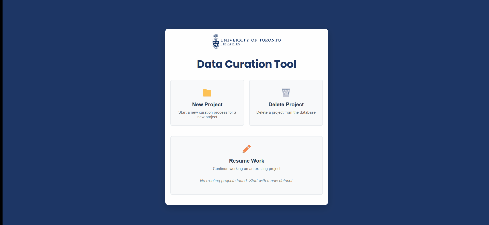

# U of T Dataverse dataset curation tool

> [!WARNING]
> This tool is under active development and is not yet production-ready. Please use it at your own risk.

A containerized dataset curation tool for Dataverse repositories with web interface support.



## 🚀 Quick Start with Docker🐋 (Recommended)

### Prerequisites
- **Docker** and **Docker Compose** installed
  - 👉 [Get Docker](https://www.docker.com/get-started)
  - Note: Docker Desktop includes Docker Compose by default

### ⚙️ Setup & Run
Refer to the [Container Guide](docs/container/README.md) for detailed setup instructions.

### Options
#### 📂 Custom Status Options
See the [Custom Status Options Guide](docs/custom_status_options/README.md) for instructions on how to define and use custom status options.
#### 🌱 Environment Variables
See the [App Settings (Environment Variables) Guide](docs/app_settings/README.md) for instructions on how to configure the application using environment variables.


> [!NOTE]
> Or if you have just installed, then you can simply run:
> ```sh
> just docker-build-and-run -f # The -f flag skips the confirmation prompt for removing existing './workdir'
> or
> just docker-build-and-run postgres -f # To include the postgres profile
> ```


### 🏗️ Development Mode
For development with rebuild and reloading the container, run:
```sh
docker compose down && docker compose build && docker compose up
```

To clean up the folders, run:
```sh
just clean
```
This will delete the `./workdir`, `./new_dir/` and `./pgadmin/` folders,

## 🧪 Validating the Checklist
See the [Checklist Validator CLI Guide](docs/checklist/README.md) for instructions on how to validate the checklist using the command line interface (CLI).

## ⬆️ Bump the version
Prerequisites:
1. [Commitizen](https://commitizen-tools.github.io/commitizen/)

This repository has set up [Commitizen](https://commitizen-tools.github.io/commitizen/) for automatic version bumping. To bump the version, run the following command in the main branch:
```sh
cz bump
```
Test the version bumping by running:
```sh
cz bump --dry-run
```