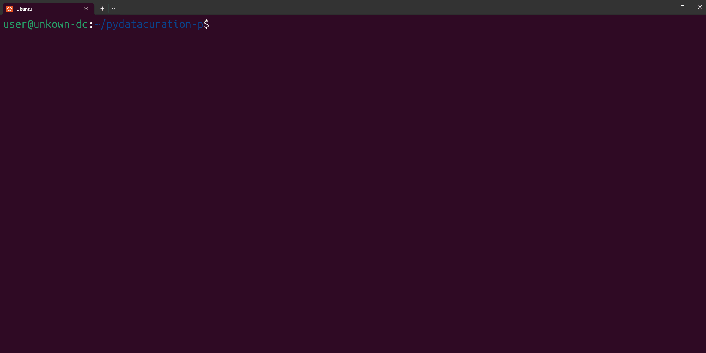
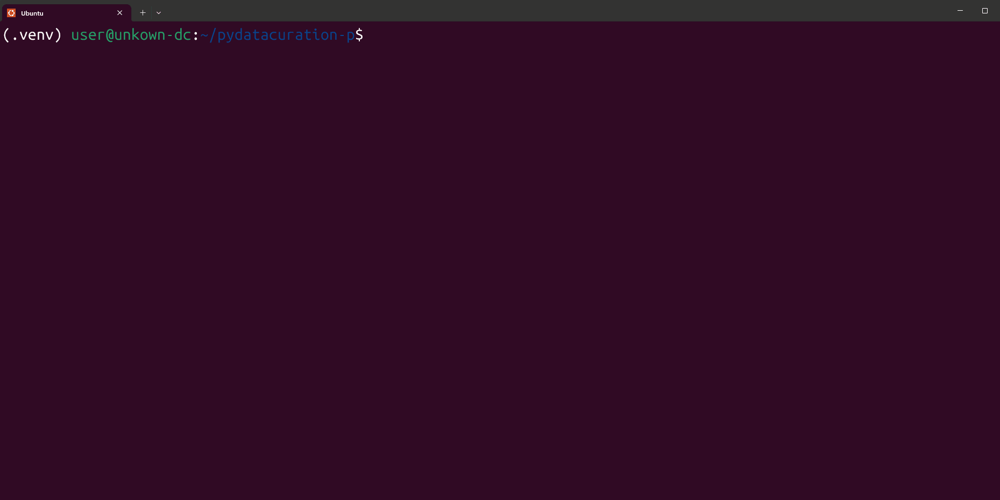

# After restart

1. Open 'Terminal' and swtich to the 'Ubuntu'


2. Run `cd pydatacuration-p` to change directory to 'pydatacuration-p'


3. Run `source .venv/bin/activate` to enter the virtual enviroment



4. Run `nano res/config.yaml` to configure the Curator Info, inside the terminal



5. Run the following command to download start the automated curated data. Replace the `$doi` with the actual doi.
   ```sh
   python3 pydatacuration/main.py --doi $DOI  # (e.g. --doi doi:10.80240/FK2/U2VZH9)
   ```

For example:
   ```sh
   python3 pydatacuration/main.py --doi doi:10.80240/FH2/U2VCH9
   ```