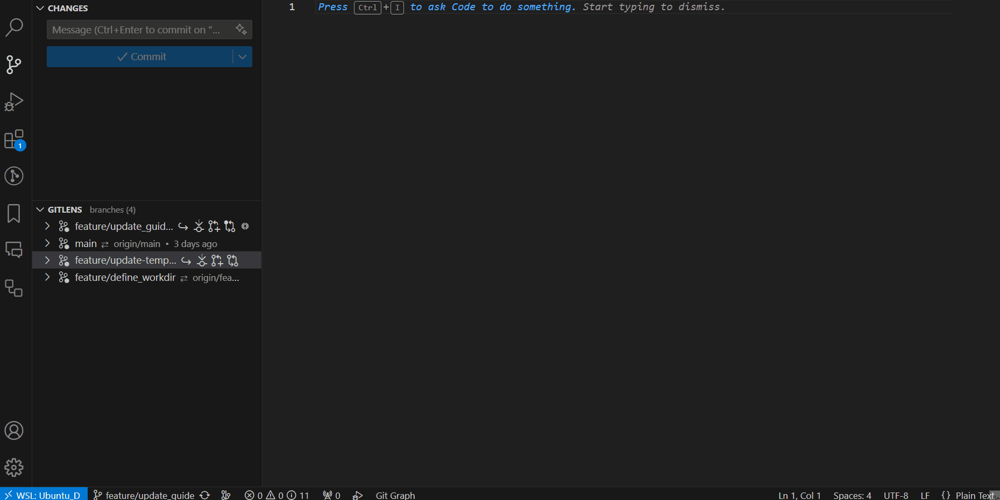
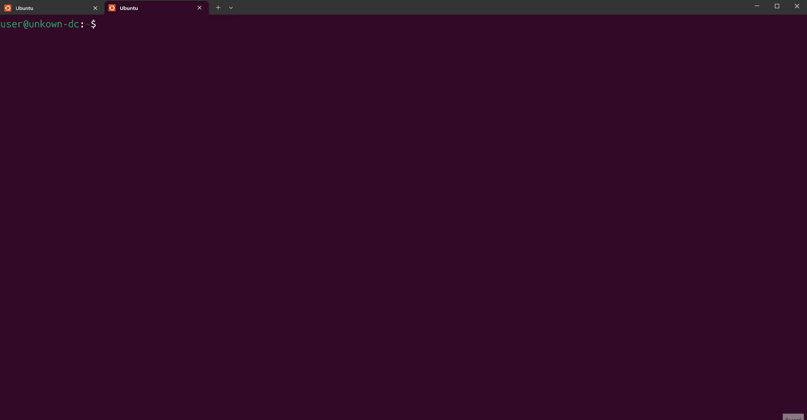
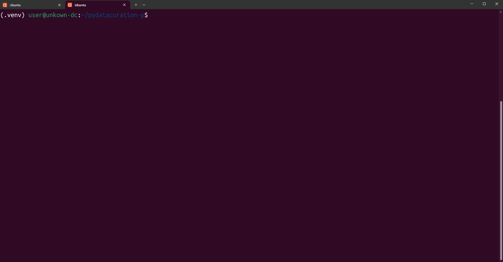

# After restart


1. Open 'Terminal' and switch to the 'Ubuntu'




2. Run the following script to initialize the python environment for running the tool, and to update the tool
```sh
cd pydatacuration-p || { echo "❌Failed to navigate to pydatacuration-p directory."; return || exit; }
source .venv/bin/activate || { echo "❌Failed to activate virtual environment."; return || exit; }
git pull origin main --quiet || { echo "Failed to pull from origin main."; return || exit; }
pip install -r requirements.txt -qq || { echo "Failed to pull from origin main."; return || exit; }
printf "\n✅Successfully configured the python environment \n"
```




3. Run `nano res/config.yaml` to configure the Curator Info, inside the terminal. You may skip this if you have done before and no changes needed.



4. To use the tool with a GUI, run the following command:
   ```sh
   python -m pydatacuration.main tui
   ```
   To use run the tool with the CLI interface, replace the values starting from the $ sign, and run the following command:
   ```sh
   python -m pydatacuration.main cli --pid ${pid} --ticket-number ${ticket-number}
   ```
   For example if your targeted pid (doi/hdl) is 'doi:10.80240/FK2/U2VZH9' and your ticket-number is 'CUR-001', your command should look like the following:
   ```sh
   python -m pydatacuration.main cli --pid 'doi:10.80240/FK2/U2VZH9' --ticket-number 'CUR-001'
   ```
