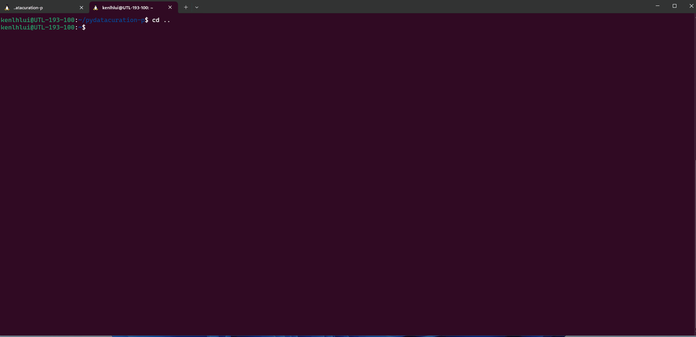
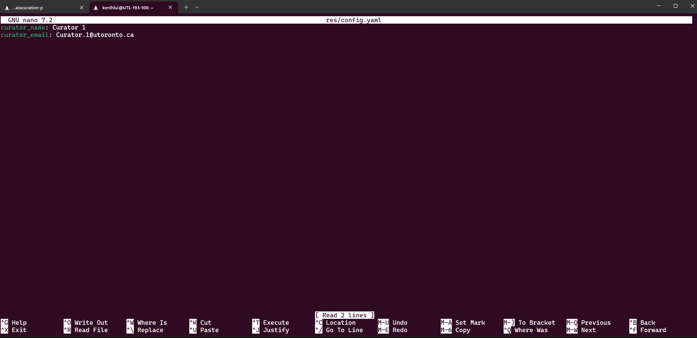

# Set Curator Info

1. Open 'Terminal', click the little down arrow next to the first tab, and switch to 'Ubuntu'
   

2. Run the following command in the terminal to open the `nano` text editor in the terminal:
   ```sh
   cd pydatacuration-p/ && nano res/config.yaml
   ```
   
   

3. Navigate the editor with your keyword arrows. Change the information.
   
   To save the information:
   
   i. Press `CTRL` + `X`. The bottom-left should prompt `Save modified butter?`.
   
   ii. Press `CTRL` + `Y`. The bottom-left should prompt `First Name to Write: res/config.yaml`.
   
   iii. Press `Enter` and the terminal should go back to the default view.

   

You have now saved the curator info in the config file.

4. See the following guide to learn how to use the tool in TUI or CLI
   
   - [Command Line Interface (CLI)](/docs/cli/README.md)
   - [Terminal User Interface (TUI)](/docs/tui/README.md)
