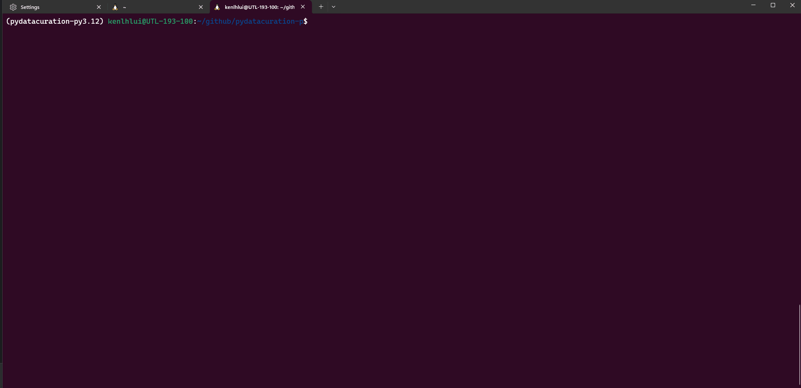
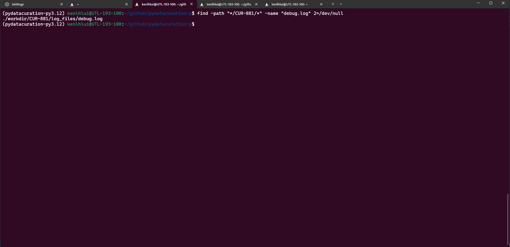

# To troubleshoot

To assist with debugging, you need to retrieve the `debug.log` file and send it to Ken. Follow these steps to locate and retrieve the `debug.log` file:

1. First, you would need to locate the path of the `debug.log` is placed. 
    
    Usage:
    ```sh
    find -path "*/projects/$project_number/*" -name "debug.log" 2>/dev/null
    ```
    Assume you specified the `project-number` as `CUR-881`. Replace the $project_number with `CUR-881` above. The code should look like as follows:
    
    ```sh
    find -path "*/projects/CUR-881/*" -name "debug.log" 2>/dev/null
    ```
    
    
    If the command is successful, it will display the path to the `debug.log` file.

2. Next, run the following to open the directory in Windows Explorer where the `debug.log` is located

    Usage:
    ```sh
    explorer.exe "$(wslpath -w "$(dirname "$(find -path "*/$project_number/*" -name "debug.log" 2>/dev/null)")")"
    ```

    Again, replace the `$project_number` with the value you specified (in this example is `CUR-881`)
    
    ```sh
    explorer.exe "$(wslpath -w "$(dirname "$(find -path "*/CUR-881/*" -name "debug.log" 2>/dev/null)")")"
    ```
    