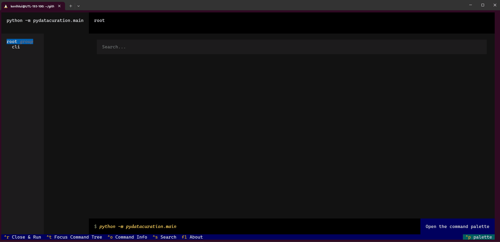
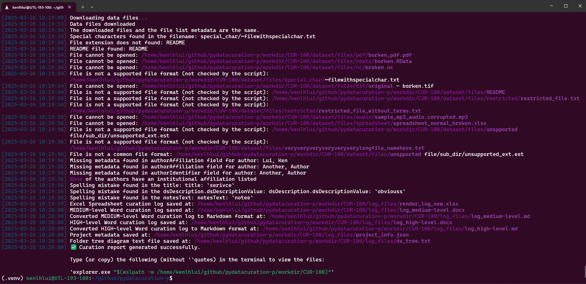

# To use the Text User Interface (TUI)

1. After activating the Python environment (you’ll see (.venv) at the start of your prompt), run:
    ```bash
    python -m pydatacuration.main tui
    ```
    

2. Click the `cli` button on the left-hand side panel. Input the information accordingly.
   
   **Required fields**:
    | Field         | Input                                                                                               | Example                               | Notes                                                                        |
    | ------------- | --------------------------------------------------------------------------------------------------- | ------------------------------------- | ---------------------------------------------------------------------------- |
    | pid           | Persistent Identifier (doi/hdl) of the dataset                                                      | doi:10.82240/FK3/FCHB4G               |                                                                              |
    | ticket-number | Ticket Number of the curation project. Can only contain letters, numbers, hyphens, and underscores. | CUR-001<br>Project_01<br>curationprj1 | The input will also be the name of the parent folder for the processed files |

    **Optional fields**:

    | Field      | Input                                    | Example                                              | Notes                                                                                                                                                                  |
    | ---------- | ---------------------------------------- | ---------------------------------------------------- | ---------------------------------------------------------------------------------------------------------------------------------------------------------------------- |
    | base-url   | The base url of the Dataverse Repository | [https://borealisdata.ca/](https://borealisdata.ca/) | If you've set the value in the .env file, you can leave this field blank.<br>If set correctly, the URL will appear in the `current value` section.       |
    | api-token  | The API token of your account            | xxxxxxxx-xxxx-xxxx-xxxx-xxxxxxxxxxxx                 | If you've set the value in the .env file, you can leave this field blank.<br>If configured correctly, \`Set\` will appear inside the \`current\` brackets.              |
    | parent-dir | The path of the working directory        | workdir<br>/user/root_dir                            | By default, a directory "workdir" will be created.                                                                                                                     |
    | force-del  | Check this box to allow overwriting of an existing directory                               | /                                                    | If selected, the tool will automatically overwrite the existing output directory, if it exists. Otherwise, it will prompt the user for confirmation before proceeding. |

    Press control key (`CTRL`) + `R` key, or click the button on the bottom-left corner `Close & Run` to start the tool.
   
    

3. After you see the message `✅ Curation report generated successfully.`, you can copy the command shown in the terminal to open the output folder in Windows File Explorer.

    
   