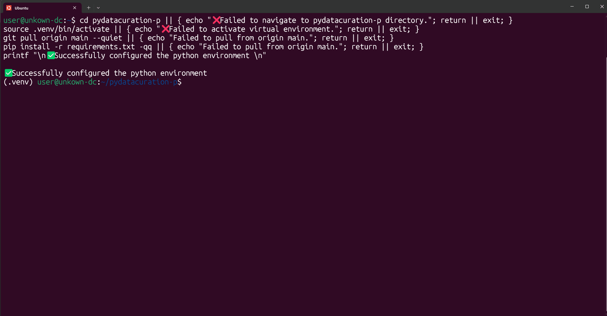

# To use the Terminal User Interface (TUI)

1. Once you have entered the python environment (with the the `(.venv)` at the beginning in the command prompt), run the following command:
    ```sh
    python -m pydatacuration.main tui
    ```
    

2. Click the 'cli' button on the left-hand side panel. Input the information accordingly: