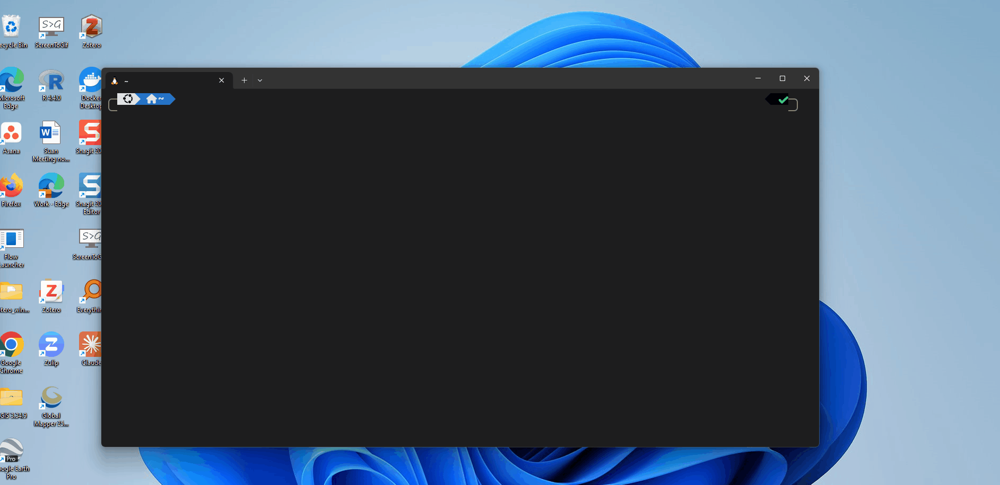
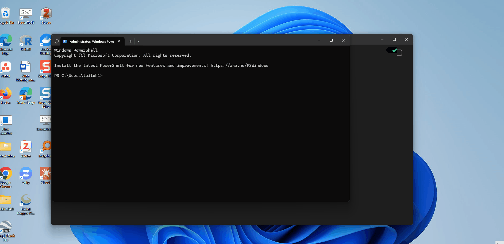

# WSL2 -Logon failure

Map and Data Library (UofT) computers sometimes would have this message after restart/idle for long time when accessing WSL2, with the message below:
> Logon failure: the user has not been granted the requested logon type at this computer.

Follow the steps below to solve the issue:
1. Open (Windows) Terminal by searching the 'Terminal'
   

2. Click the dropdown arrow in the Terminal window, select 'Windows PowerShell,' then right-click and choose 'Run as administrator.' When prompted, enter the administrative credentials to proceed.
   

3. Once logged in, you should see 'Administrator: Windows Powershell' for the tab name. That means you have successfully enter the terminal with administrative access. Copy and paste to run the command below in the terminal.
    ```PowerShell
    Get-Service vmcompute | Restart-Service
    ```

   
4. You should now be able to access the WSL2. Check the ['after restart' guide](/docs/after_restart/README.md) to see how to run the tool after restarting the computer or exiting the terminal.
